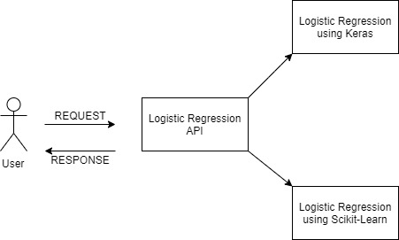

# AI REST Services using Open API

Sahithi Ancha, sancha@iu.edu, [fa19-516-174](https://github.com/cloudmesh-community/fa19-516-174)

## Issues

* does not leverage cloudmesh you make your life to complex without it
  dockerfile is questionable as mount or git clone not used (either one,
  but the way you do the copy is not appropriate, as you can not easily
  develop in your container and you make life to comples

* docker mongo db container has security flaw as it does not set up
  admin user, look at cloudmesh cmsd developed by TA. As he may not
  have completed this this may be a reason for you to justify an
  incomplete. E.g. his task was to deliver this some month back. I am
  not sure if its usable at thsi time. he claims it is. Last friday it
  was unclear. Get appointment with Ta to make sure this runs on your 
  computer.

* dnspython is somehow internally used by something, but is not
  automatically installed for some reason. this is used for the mongodb
  uri. This has to be further invertigated, as we shoudl not have to
  explicitly include this in the requiremnts. I may be wrng on thsi
  (Gregor)
  
## Abstract

:o2: this is not the aim its an example of our aim, you did not
understand the large picture

We try to develop an AI-service for the logistic regression
functionality via two methods, namely Scikit-Learn and Keras. The user
inputs a file which is saved to the MongoDB database. Then we retrieve
the same file and perform logisctic regression on it according to the
user input, i.e., based on the service the user specifies.

## Introduction

We first connect to the MongoDB database via the server file which also
directs us to the Open Api scpecification which contains the endpoints
for the user to access. I created a seperate python file to make
uploading files by the user much easier. The uploaded file that is in
the '.csv' format is converted to json and then uploaded to the
database. When the user indicates that they want to fit and predict
based on the dataset they provide, this same file is retrieved and then
processed in order to fit a logistic regression model, predict values
and also print out the accuracy score.

To connect to the MongoDB database, I used cloudmesh -> mongo ->
cmdatabase. Also, I can upload any file in the same directory with ease
but if it's in a different folder, this upload function does not work
and I have to fix it.

Additionally, I also have a seperate Image classification API that is
based on Keras. A pretrained model - ResNet 50 is used for this. An
image is simply uploaded by the user. This image is initially stored on
the database, retrieved and processed on request and the top three
predictions for that particular image are returned as an output to the
user.

To-do: 

* I'm trying to figure out how to convert the json file back into a csv
  file before proscessing it. Alternatively, i'm also trying to save the
  csv file as it is without changing its format so that it's easier to
  retrieve and process.

* I got the part of returning values after fitting them wrong and need
  to use Jsonify as Professor mentioned. While my program can fit and
  predict with an average accuracy score, I need to find a better way to
  pass the values returned from fit to the predict function.)

## Design 
### Architecture

{#fig:174-arch}

## Implementation
### Technologies Used
* cloudmesh
* Python
* REST
* Open API
* Flask
* MongoDB

## Results
### Deployment Benchmarks
### Application Benchmarks
### Benchmark and Evaluation 

* Access and use the AI services 

## Conclusion

## References

*
