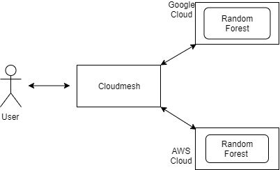

# AI REST Services using Open API

Sahithi Ancha, sancha@iu.edu, [fa19-516-174](https://github.com/cloudmesh-community/fa19-516-174)
  
## Abstract

We try to develop a dockerized AI REST based service for the Random Forest functionality via Scikit-Learn. This application is deployed on Google cloud as well as AWS. The user should be able to access and run curl commands from their own terminal with the ip address provided. CSV files can be uploaded to fit and predict.

## Introduction

A REST based OpenAPI service is created to provide Random Forest as a service. The implementation for this is obtained from Scikit-Learn as well as the K-means example provided by the Professor. This application is bundled together with a dockerfile that specifies instructions on how to deploy the app. The requirements.txt file specifies the packages required for the application to run. The docker image that is build using this file is pushed to the containers in each of the clouds. Based on this image, an application/service is created and run. 

## Design 
### Architecture

## Implementation

### Technologies Used
* Cloudmesh
* Python
* REST
* Open API
* Flask
* Google Cloud
* AWS

The first step is to create a simple service that demonstrates the random forest function. All the required files are bundled in an app and a Dockerfile is added as well. This same file is used to build an image later on for deploying onto the cloud services. The dockerfile tells the system to install the requirements and run the server file. This server file in turn points to the yaml file that specifies and configures the end points for our application. 

The first cloud setup I've used is Google. I have created a project called cloudmesh (same as it was mentioned in the document), enabled the API and also created a service account key aand saved it as google.json in the ~/.cloudmesh/security folder and then registered it to cloudmesh. The entire procedure has been based on the document - https://cloudmesh.github.io/cloudmesh-manual/accounts/google/account.html. We create and connect to a cluster next. A docker image is built from the existing dockerfile. This image is then tagged and pushed to the google container registry. From this image we create a deployement using the deployment.yaml file, which makes it easier for us to configure any sepcifications we have. Once the deployment has been created, to be able to access it outside of the kubernetes cluster, we create a service and run it. Once created, an external IP address is provided, which we can use to run our curl commands. 

The IP address that can be used to access this service is http://34.74.93.11:5000/.
To test the service, I have created my own csv files with simple classification. The following curl commands can be used to upload csv files -

To upload a file: 
curl -X POST "http://34.74.93.11:5000/rf/upload" -H "accept: application/json" -H "Content-Type: multipart/form-data" -F "file=@<filename>.csv;type=text/csv"

To fit the data with specified parameters: 
curl -X POST "http://34.74.93.11:5000/rf/fit" -H "accept: text/csv" -H "Content-Type: application/json" -d "{\"job_id\":0,\"model_params\":{\"max_depth\":2}}"

To predict a file: 
curl -X POST "http://34.74.93.11:5000/rf/predict" -H "accept: text/csv" -H "Content-Type: multipart/form-data" -F "job_id=0" -F "file=@<filename>.csv;type=text/csv"
  
Coming to the AWS cloud, similar to the procedure followed for google, we create an account and add a new user (belonging to the cloudmesh security group) and give them EC2FullAccess perimission. The credetials file obtained will be used to interact with the cloud. The cloudmesh.yaml file is configured with the paramaters obtained. Then the cloud and key are visualised and a new vm is booted. This procedure is the same as mentioned in https://cloudmesh.github.io/cloudmesh-manual/accounts/aws.html. Next, a repository is created on AWS Elastic Container Registry. The docker image built is then pushed to this container. A task definition and cluster are created so that a service can be launched. However, in my case the end result when trying to access the IP shows the error code 502: Bad Gateway. I have tried other methods but nothing seems to work so far. However, I will keep trying and find out where I'm going wrong.

## Results

Being hosted on a google or aws server implies that the service is easily accessible from anywhere as long as we have the IP address to access it. This makes tasks such as fitting and predicting new data much easier while offloading tasks such as writing multiple files of code.

## Conclusion and Future Work

While this app that has been deployed is a simple REST based OpenAPI service, multiple AI services can also be implemented as a single application. Much more complicated tasks such as Data Visualisation and analysing Time Series can also be implemented. A more interesting application would be to create an image classification app. To make it more user-friendly, a front-page can be developed as well. I have also dabbled around with Chameleon and Oracle and hope to get a better understanding of the two. Travis CI didn't quiet work out for this project and I'm hoping I can integrate it in the future.

## References

* https://cloudmesh.github.io/cloudmesh-manual/accounts/openstack.html
* https://cloudmesh.github.io/cloudmesh-manual/accounts/google/account.html
* https://cloudmesh.github.io/cloudmesh-manual/accounts/aws.html
* https://cloud.google.com/kubernetes-engine/docs/quickstarts/deploying-a-language-specific-app#python
* https://scotch.io/tutorials/google-cloud-platform-i-deploy-a-docker-app-to-google-container-engine-with-kubernetes
* https://docs.aws.amazon.com/AmazonECS/latest/developerguide/create-task-definition.html

## Appendix

Results for Google Cloud-

* Upload file

* Specify parameters and fit

* Predict a new file

